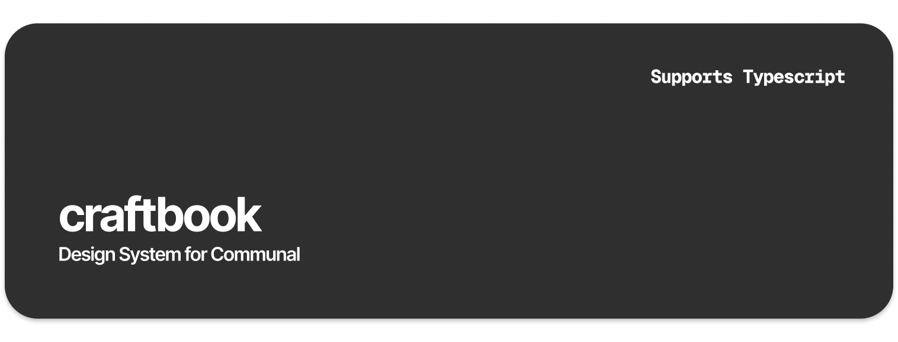

# CraftBook - Design System for Communal



CraftBook is a versatile React component library developed with TypeScript and styled using TailwindCSS. 
It offers a collection of reusable UI components to streamline the development of React applications.

## Getting Started

### Installation

You can install CraftBook using either NPM or Yarn. Here are the steps for both:

NPM
```
npm install craftbook
```

Yarn
```
yarn add craftbook
```

### Running Storybook

CraftBook uses Storybook for component development and testing. 
Follow these steps to run the Storybook:

1. Ensure you have Node.js and npm installed on your machine.
2. Clone the CraftBook repository:
```
git clone https://github.com/communal/craftbook.git
```

3. Navigate to the project directory:
```
cd craftbook
```

4. Install dependencies:
```
npm install
```
or
```
yarn
```

5. Start Storybook:
```
npm run storybook
```
or
```
yarn storybook
```

6. Open your browser and visit http://localhost:6006/ to view the CraftBook Storybook, where you can interactively explore and test the components.

## Contributing

We welcome contributions to CraftBook! If you find any issues or have suggestions for improvement, please open an issue or submit a pull request.